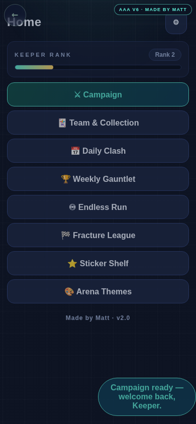
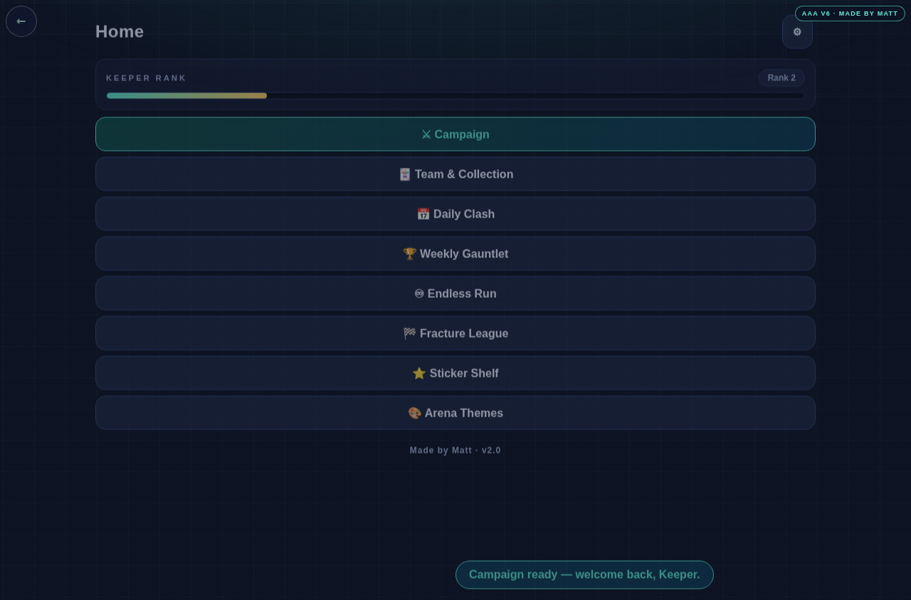

# Final handoff visual review — 2026-09-07

The original archive10003623098 was downloaded again after the scratch-directory loss and its SHA2562399d16cbac5cead1f09010a2e2b8be6328e788ab6d26398912773fa3b0f961d matched. Root read the source receipts and all ten case rows; a separate read-only reviewer independently checked all ten screenshots and the three actual publication component hashes. Root also inspected phone/desktop successful import, empty-origin and rejection captures.

The genuine transfer works in the reported matrix: small fragments, latest-at-click state, large native JSON file, empty origin and rejection at390/1280. The ten generated rows are retained in HC3_HANDOFF_LIVE_2026-09-07.json; the original receipts are in HC3_HANDOFF_PUBLICATIONS_2026-09-07.json. These are copied reports from the original digest-verified CI archive, not a new test run.

At390px the fixed HUD back circle overlaps the Home heading after successful import. Transfer controls remain visible; these captures do not establish whether the overlap is a regression. No flawless visual-QA claim is made. Treat this as a named layout residue, with fresh ownership and before/after native/browser proof before a separate correction. Desktop has no corresponding overlap in the saved capture.

The education www origin redirects before storage access and is explicitly UNAVAILABLE_ORIGIN. Its old saves were neither seeded nor read. Apex recovery passing does not establish www recovery.

The temporary execution hold was resolved by restoring committed Git sources into /workspace/scratch/hc3-recovery-20260907. Surviving partial old worktree files were copied for preservation before reconstruction; earlier remote checkpoints remain. Apps48 and Lessons362 subsequently merged their tested scheduling change. Apps162e65b publication34083717981 completed04:40:54Z and automatically triggered live workflow34084006532 at04:40:56Z. Original live artifact10004602618 (SHA25688714707eafba4d084709735eacf1400944170c58d5f7a3d7b190c29753486d3) proves all nine files against publication artifact10004575977. This supersedes the earlier plan-only scheduling hold in the dated health checkpoint.
